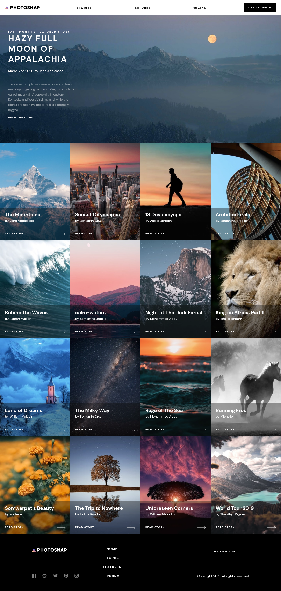

# Frontend Mentor - Photosnap Website solution

This is a solution to the [Photosnap Website challenge on Frontend Mentor](https://www.frontendmentor.io/challenges/photosnap-multipage-website-nMDSrNmNW). Frontend Mentor challenges help you improve your coding skills by building realistic projects. 

## Table of contents

- [Overview](#overview)
  - [The challenge](#the-challenge)
  - [Screenshot](#screenshot)
  - [Links](#links)
- [My process](#my-process)
  - [Built with](#built-with)
  - [What I learned](#what-i-learned)
  - [Continued development](#continued-development)
  - [Useful resources](#useful-resources)
- [Author](#author)
- [Acknowledgments](#acknowledgments)


## Overview

### The challenge

Users should be able to:

- View the optimal layout for each page depending on their device's screen size
- See hover states for all interactive elements throughout the site

### Screenshot




## My process

- the challenge has four pages which are the Home page, Stories page, Features and Pricing page.

### Reading the design files

- creating the reset file.
- create the sass variables for font-sizes, typography, spacings etc
- create utility classes - classes that have a special assignment
- read the design files for each page for mobile , tablet and desktop and vice-versa to 
analyse how to design and structure the html. That helps to see which components can be grouped
together to get the most of the required designs.
- simplify the reading by looking at components that are likely to be shared.  The common are usually 
the header and footer.

### creating the data.json file

- the photosnap site has several data that needs some organisation, of particular interest is the images. It was going to be a longer code by importing each and every image in the files that they are needed.

### Importing the data and usage

- used the context api for data management `import { useState, createContext, useEffect } from 'react'`
- used axios to fetch the data `import axios from 'axios'`
- create the context `export const DataContext = createContext()`

```jsx
export const DataProvider = (props) => {
    const [data, setData] = useState([])
    const [fetchStatus, setFetchStatus] = useState('idle')
    const [homePage, setHomePage] = useState("")
    const [stories, setStories] = useState("")
    const [features, setFeatures] = useState("")
    const [pricing, setPricing] = useState("")
    const [shared, setShared] = useState("")

    //get data from json api
    const getData = async () => {
        await axios.get('/data.json', {
            headers: {
                'Content-Type': 'application/json',
                'Accept': 'application/json'
            }
        }
        )

            .then(function (response) {
                return response.data;
            })

            .then(function (myJson) {
                setData(myJson)
                setHomePage(myJson[0])
                setFeatures(myJson[1])
                setPricing(myJson[2])
                setShared(myJson[3])
                setStories(myJson[4])
            });

    }

    useEffect(() => {
        getData()

        setFetchStatus("success")
    }, [])
   
    if (fetchStatus === 'idle' || fetchStatus === 'loading') {
        return <div className='loading'>
            <h2 className='loading-title'>Loading...</h2>
        </div>
    }

    return (
        <DataContext.Provider value={{ data, homePage , stories, pricing, features, shared}}>
            {props.children}
        </DataContext.Provider>
    )
}
```
- a series of states has been created to help get the data at paticular stages.
- for DataContext to work it is important to point out that all the components that uses the data should be nested as follows on the main component. The Home , Stories, Features and Pricing page can all get the same data and get the same state if it changes in any of the pages. As with this challenge the data is not changing

```jsx
<div className="App">
      <Header />
      <DataProvider>
        <Routes>
          <Route path="/" element={<Home />} />
          <Route path="stories" element={<Stories />} />
          <Route path="features" element={<Features />} />
          <Route path="pricing" element={<Pricing />} />
        </Routes>
        <Footer />
      </DataProvider>
    </div>
```

### creating the header and navigation

- the header comprises of the photosnap logo on the right which can be used as the home navigation
- on mobile devices on the right hand side there is a toggle button that opens and closes the rest of the 
navigation list items. I used `display: flex`
- on tablet and desktop the toggle button for mobile should be hidden and the navigation should always 
be displayed

### creating the Main section

#### Hero section

- all the pages has a similar layout of the hero section. It has an image and content section but displayed differently in some layout of the tablet and desktop section. The mobile is generally a top to bottom approach.

#### Hero section - home page , Feature Page and Pricing page

- the layout for the hero page on mobile has the image on top and the content is below
- for tablet and desktop the image is on the left and the content is on the right. The content takes about 2 fifth (2/5) of the available space while the image space is about 3 fifth (3/5). Displayed using flex.

#### Hero section - Home page 

- there is 3 hero sections for the home page . The design for the three are the same with a few exception. The hero sections are contained in the div class `home-primary` with the first class of the content having a dark background and the other 2 have a white background.  The first and third `home-primary` class has a flex-direction of row-reverse while the middle one has the default value of row.

##### Hero section - Stories page 

- the layout of the hero section for the tablet and desktop is different from the other pages. The content is sitting on top of the image which in this scenario acts as a background image. To achieve that the `main-stories` container is set to position relative and the `hero-content`is set to position absolute with a z-index to allow it to be on top of the image

#### Main Sections

- Here are the main components for the site 
  - Hero - all pages 
  - Story - Home and Story Page
  - FeatureList - Home and Feature page
  - Complimentary - Feature and Pricing page
  - Footer - all pages
  - Plans (pricing page)
  - Products  (pricing page)

### Built with

- sass custom properties
- Flexbox
- CSS Grid
- Mobile-first workflow
- [React](https://reactjs.org/) - JS library

### What I learned


### Continued development

- active states on the story cards as per design

### Useful resources

- [React/gsap basics](https://ihatetomatoes.net/module-1/rg-101-05-create-an-array-of-refs-341/) - using scrolltrigger on a react app
- [Toggle-amount-switcher](https://www.sarasoueidan.com/blog/toggle-switch-design/)


## Author

- Website - [Chamu Mutezva](https://github.com/ChamuMutezva)
- Frontend Mentor - [@ChamuMutezva](https://www.frontendmentor.io/profile/ChamuMutezva)
- Twitter - [@ChamuMutezva](https://twitter.com/ChamuMutezva)


## Acknowledgments

Frontend Mentor